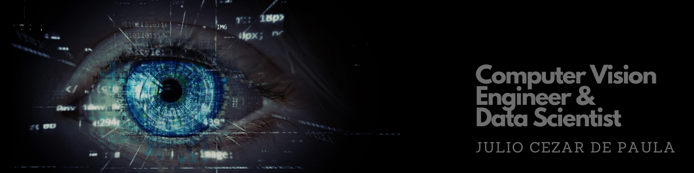

  

  
  
  

 

# Júlio Cézar de Paula

Aqui você pode encontrar meus projetos de Data Science e Visão Computacional.

**Contate-me**
* [LinkedIn](https://www.linkedin.com/in/j%C3%BAlio-c%C3%A9zar-de-paula-0b64b8226/)
* [Medium](https://medium.com/@jcp.paula17)

## Projetos:

### Data Science

* [Business Intelligence com Google Cloud Products](https://github.com/jcppaula/Business-Intelligence-com-Google-Cloud-Products/blob/main/Business_Intelligence_com_Google_Cloud_Products_21_02_23.ipynb)

### Visão Computacional

* [Detecção Facial em imagem usando OpenCV e Dlib](https://github.com/jcppaula/Deteccao_Facial_em_Imagem_com_Opencv_e_Dlib)
* [Detecção Facial em video usando OpenCV e Dlib](https://github.com/jcppaula/Deteccao_Facial_em_Video_com_Opencv_e_Dlib/blob/main/README.md)
* [Detector de Fadiga](https://github.com/jcppaula/Detector_de_Fadiga/blob/main/README.md)
* [Técnicas de Keying com OpenCV: Criação de Cenários Virtuais](https://github.com/jcppaula/Tecnicas_de_Keying_com_OpenCV-Criacao_de_Cenarios_Virtuais/blob/main/README.md)

